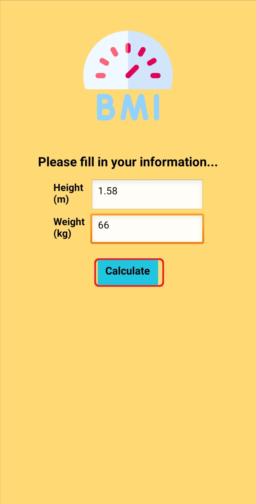
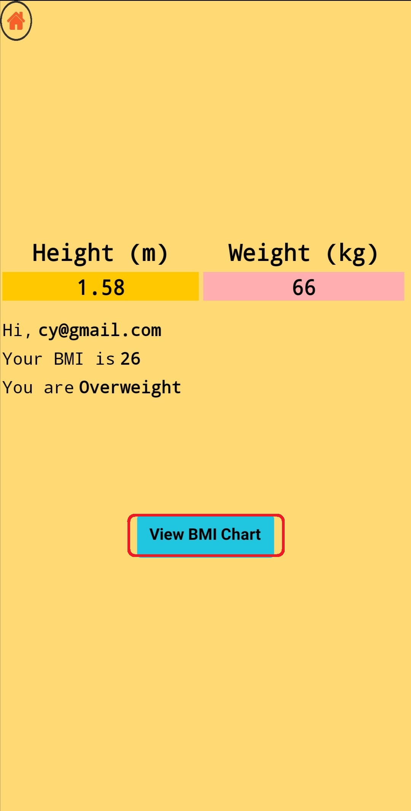
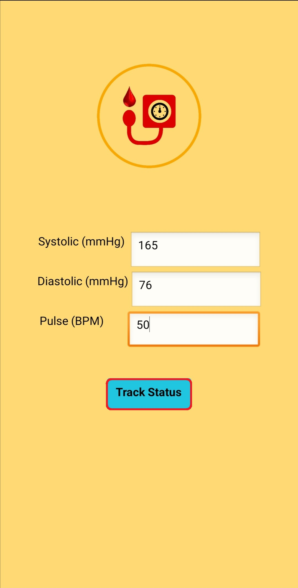

### Usage Manual ###
Step 1: First, download and install the application (.apk) file from our Github repository.

Step 2: After that will see the login page, the first time user need to go register page to register.  

 

Step 3: User need to fill in the information such as email, password and the confirm password, the password needs to fill in at least 8 characters, if register successful, it will show that "Register Successful~".  

 

Step 4: At the login page, user need to fill in their "Email" and "Password".  

 

Step 5: After login, it will show the Home Page, user can choose to calculate the BMI or key in the Blood Pressure information to check the status.  

 

Step 6: If the user choose BMI, user need to type the height and weight, then press the calculate button to calculate their BMI.  

 

Step 7: After pressing the calculate button, it will show the BMI result and status of the BMI, it also can click the button "View BMI Chart" to view the chart that records all users who use the application's BMI status percentage.  

  

 

Step 8： If the user choose the Blood Pressure, user require to fill in the information Systolic (mmHg), Diastolic (mmHg) and Pulse (BPM), then click the button "Track Status". 

  

Step 9: This is the result of the track status for user's blood pressure.  

 

Step 10: While user click the "Sign Out" button, it will go to login page.  

 
